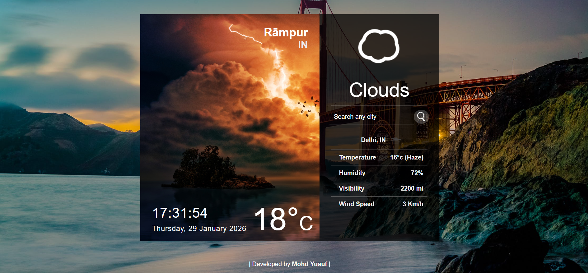

# 🌤️ React Weather Application

A smart and responsive Weather Application built using **React.js** that shows real-time weather data using the OpenWeather API.

---

## 📸 Screenshot

## ✨ Features

- Search weather by city name  
- Shows temperature, humidity, wind speed  
- Real-time weather data using OpenWeather API  
- Responsive UI for mobile and desktop  
- Built with modern React concepts (hooks, components, state)  

---

## 🛠️ Tech Stack

- React.js  
- JavaScript  
- CSS  
- OpenWeather API  

---

## ⚙️ Install dependencies

npm install

## ⚙️ Start development server

npm start

